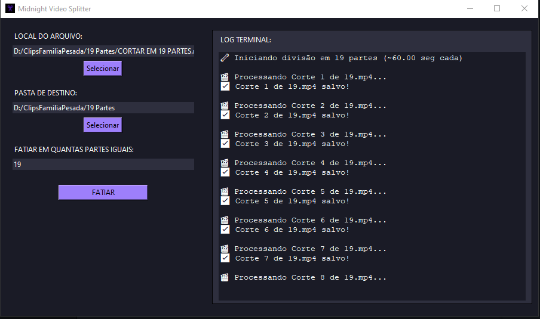

# 🎬 Midnight Video Splitter 🌙

Uma aplicação para **dividir vídeos longos em partes menores iguais**, com interface escura estilizada e fácil de usar — feita em **Python + MoviePy + Tkinter**.



---

## ✨ Funcionalidades

- ✂️ Divide vídeos `.mp4`, `.mov`, `.avi` em partes exatamente iguais
- 🧠 Gera nomes automáticos para cada fatia (`Corte 1 de 5.mp4`, etc.)
- 🖥️ Interface escura inspirada em **Midnight Theme**
- ⚙️ Terminal embutido com logs de progresso
- 💾 Salva as fatias diretamente na pasta escolhida
- ✅ Compatível com qualquer sistema que suporte Python

---

## 📦 Download

Baixe a versão `.exe` para Windows:

👉 [🔗 Ir para Releases](https://github.com/DerikDembinski0/MidnightVideoSplitter/releases)

> Sem precisar instalar Python ou dependências!

---

## 🚀 Executar localmente (modo desenvolvedor)

### Requisitos

- Python 3.11+
- moviepy

### Instalação

```bash
git clone https://github.com/DerikDembinski0/MidnightVideoSplitter.git
cd MidnightVideoSplitter
pip install -r requirements.txt
python main.py
```

🛠️ Compilar .exe com PyInstaller
```bash
pyinstaller main.py --noconfirm --onefile --windowed --icon=icone.ico --add-data "icone.ico;."
```
O executável será gerado na pasta dist/.


Desenvolvido por Derik Dembinski


